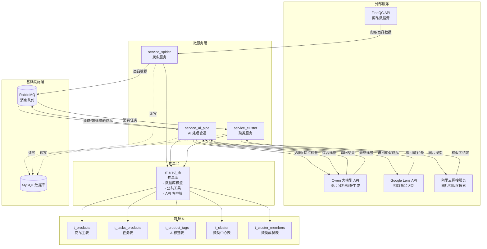
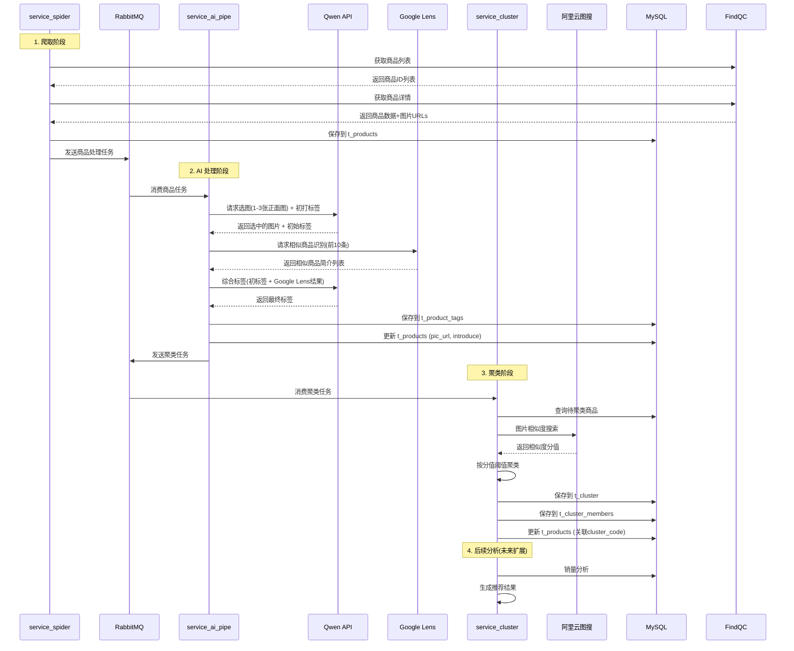
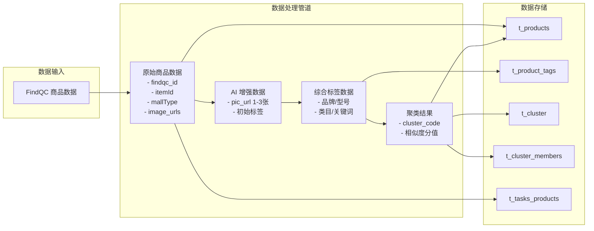
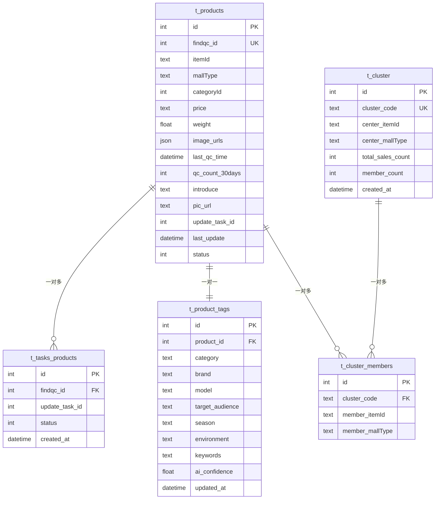
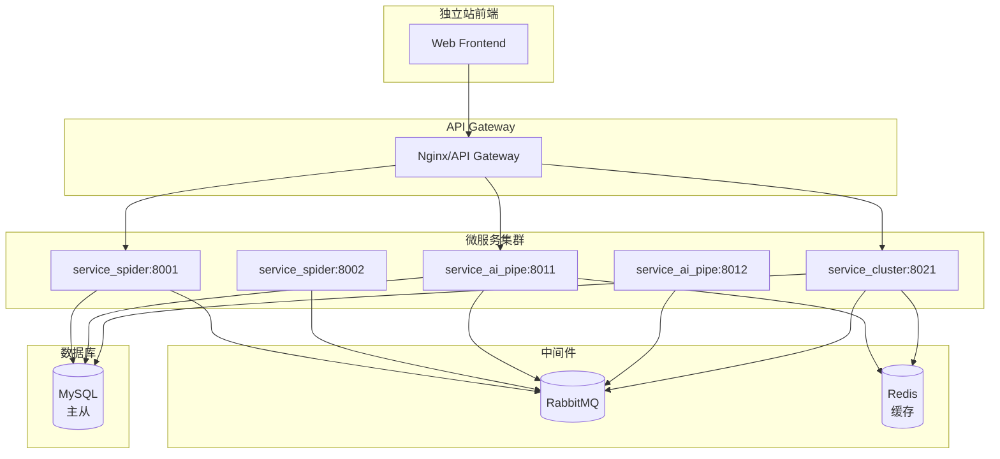

# FindQC 商品重构与 AI 聚类系统 - 架构设计文档

## 一、系统架构总览

### 1.1 微服务架构图



### 1.2 业务流程时序图



### 1.3 数据流图



### 1.4 数据库关系图



## 二、技术栈说明

### 2.1 核心技术

- **语言**: Python 3.9
- **数据库**: MySQL
- **ORM**: SQLAlchemy (Async) 或 Tortoise-ORM
- **消息队列**: RabbitMQ
- **API 框架**: FastAPI (推荐) 或 Flask

### 2.2 外部 API 服务

- **FindQC API**: 商品数据源
- **Qwen API**: 大模型服务（图片分析、标签生成）
- **Google Lens API**: 相似商品识别
- **阿里云图搜 API**: 图片相似度搜索

## 三、微服务职责划分

### 3.1 service_spider（爬虫服务）

**职责**:
- 从 FindQC API 爬取商品数据
- 处理分类列表、商品详情、图片 URL
- 数据清洗和格式化
- 写入数据库并发送任务到消息队列

**输入**: FindQC API
**输出**: 商品数据 → MySQL + RabbitMQ

### 3.2 service_ai_pipe（AI 处理管道）

**职责**:
- 调用 Qwen API 选择商品正面图（1-3张）并生成初始标签
- 调用 Google Lens API 识别相似商品（前10条）
- 调用 Qwen API 综合生成最终标签
- 更新商品数据（pic_url, introduce）

**输入**: RabbitMQ 消息（商品ID）
**输出**: AI 标签 → MySQL + RabbitMQ

### 3.3 service_cluster（聚类服务）

**职责**:
- 调用阿里云图搜 API 进行图片相似度搜索
- 根据相似度分值进行商品聚类
- 管理聚类中心（cluster）和成员关系（members）
- 计算聚类统计数据（销量总和、成员数量）

**输入**: RabbitMQ 消息（待聚类商品）
**输出**: 聚类结果 → MySQL

### 3.4 shared_lib（共享库）

**职责**:
- 定义所有数据库模型（SQLAlchemy/Tortoise ORM）
- 提供公共工具函数
- API 客户端封装（FindQC、Qwen、Google Lens、阿里云图搜）
- 消息队列连接和消息格式定义

**使用者**: 所有微服务

## 四、消息队列设计

### 4.1 队列定义

```
Exchange: findqc_tasks
├── Queue: spider.products         # 爬虫服务 → AI 处理
│   └── Routing Key: product.new
├── Queue: ai.products             # AI 处理 → 聚类服务
│   └── Routing Key: product.labeled
└── Queue: cluster.products        # 聚类任务
    └── Routing Key: product.cluster
```

### 4.2 消息格式示例

**商品爬取完成消息**:
```json
{
  "task_id": "2024052001",
  "findqc_id": 12345,
  "product_id": 1001,
  "action": "product.new",
  "timestamp": "2024-05-20T10:00:00Z"
}
```

**AI 处理完成消息**:
```json
{
  "product_id": 1001,
  "findqc_id": 12345,
  "pic_url": "https://...",
  "tags": {...},
  "action": "product.labeled",
  "timestamp": "2024-05-20T10:05:00Z"
}
```

## 五、部署架构（未来规划）



## 六、下一步开发计划

1. ✅ 数据库设计完成（db_structure.dbml）
2. ⏳ 创建架构文档（本文档）
3. ⬜ 实现 shared_lib/models.py（数据库模型）
4. ⬜ 实现 service_spider（爬虫服务）
5. ⬜ 实现 service_ai_pipe（AI 处理管道）
6. ⬜ 实现 service_cluster（聚类服务）
7. ⬜ 集成 RabbitMQ 消息队列
8. ⬜ 编写 API 文档
9. ⬜ 部署和测试

---

**文档版本**: v1.0  
**最后更新**: 2024-05-20  
**维护者**: 开发团队

