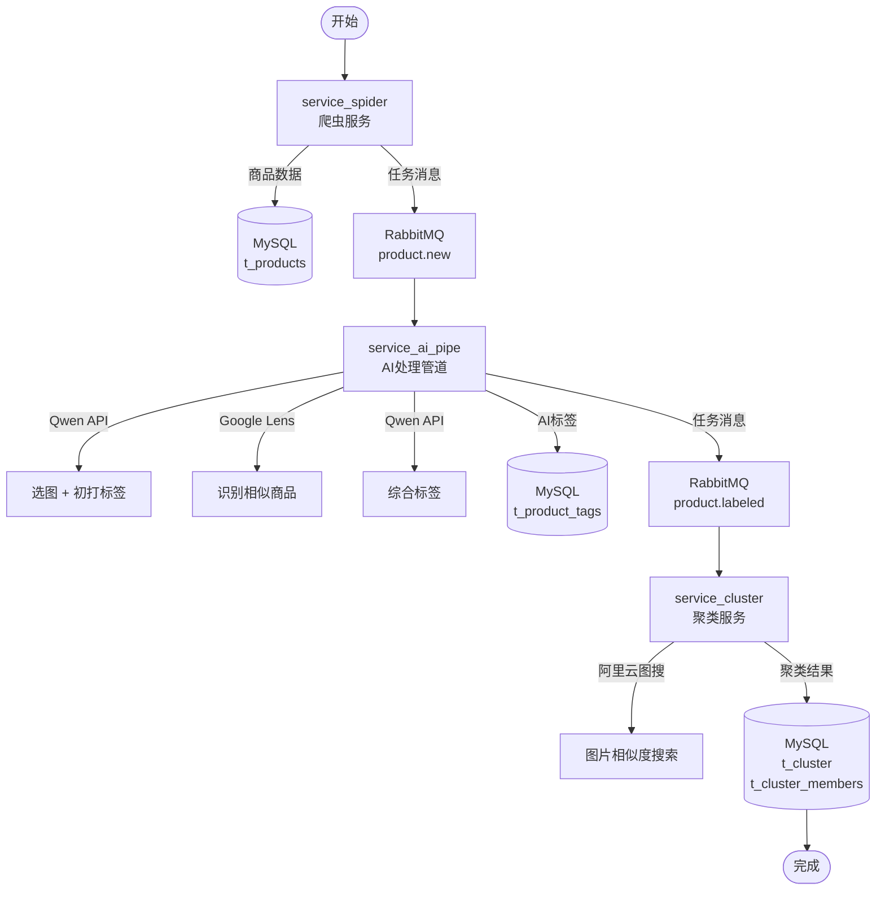
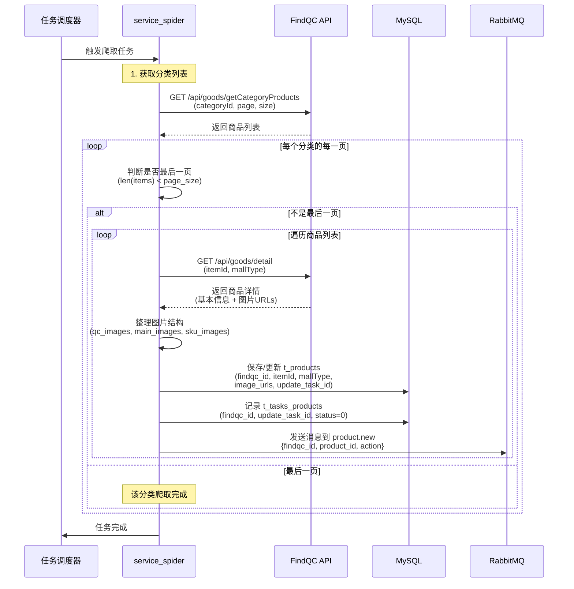
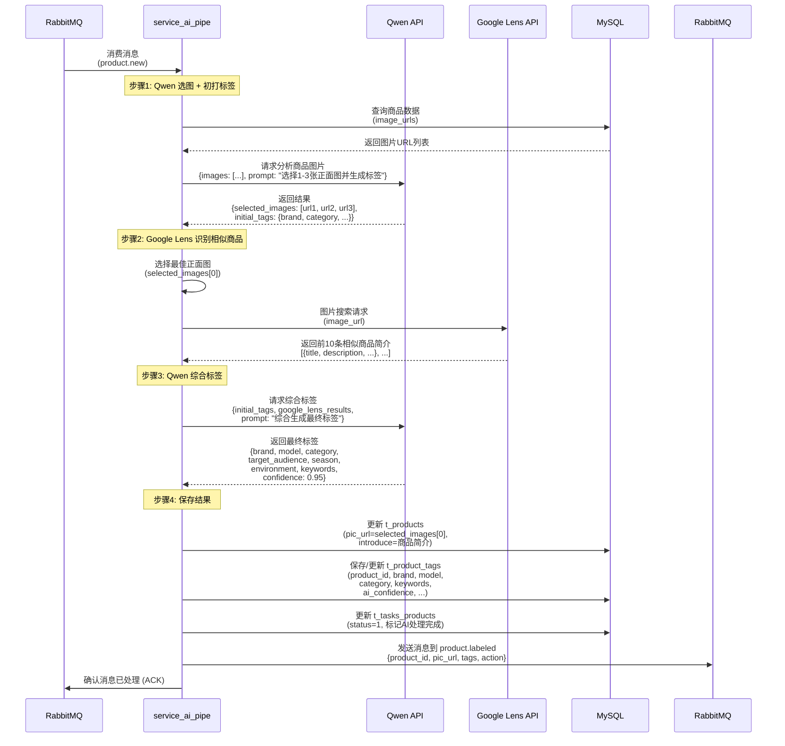
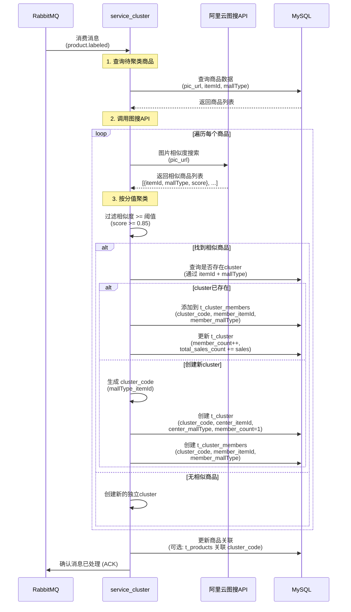
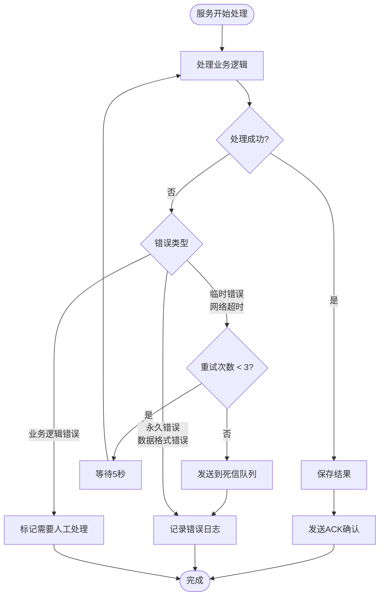
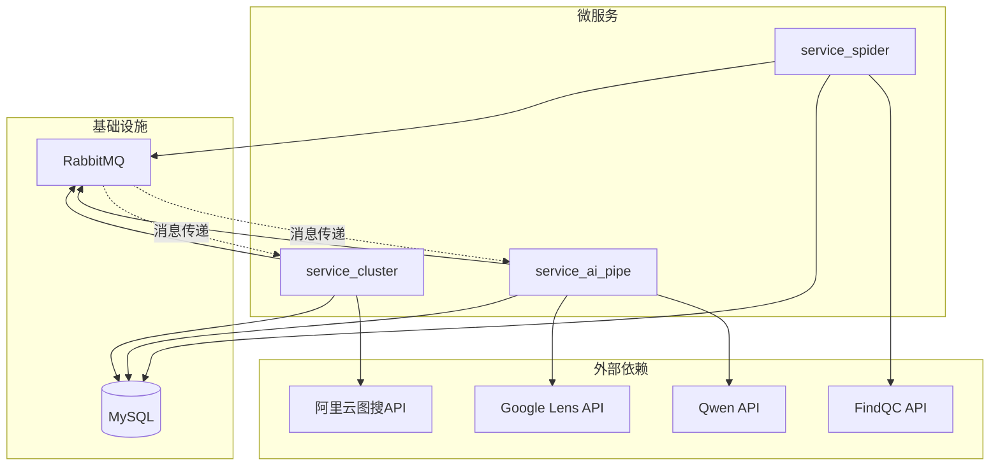
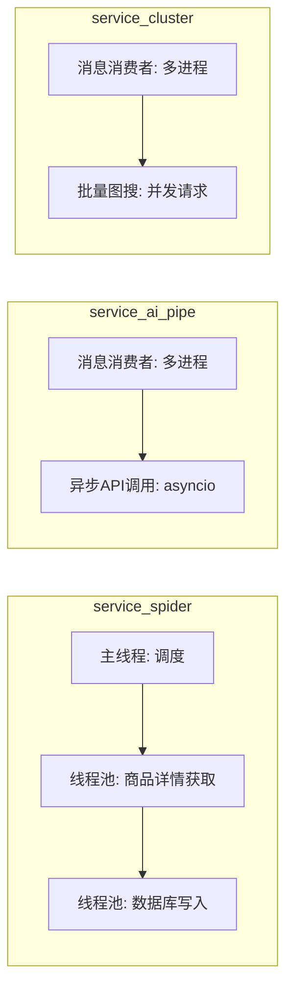
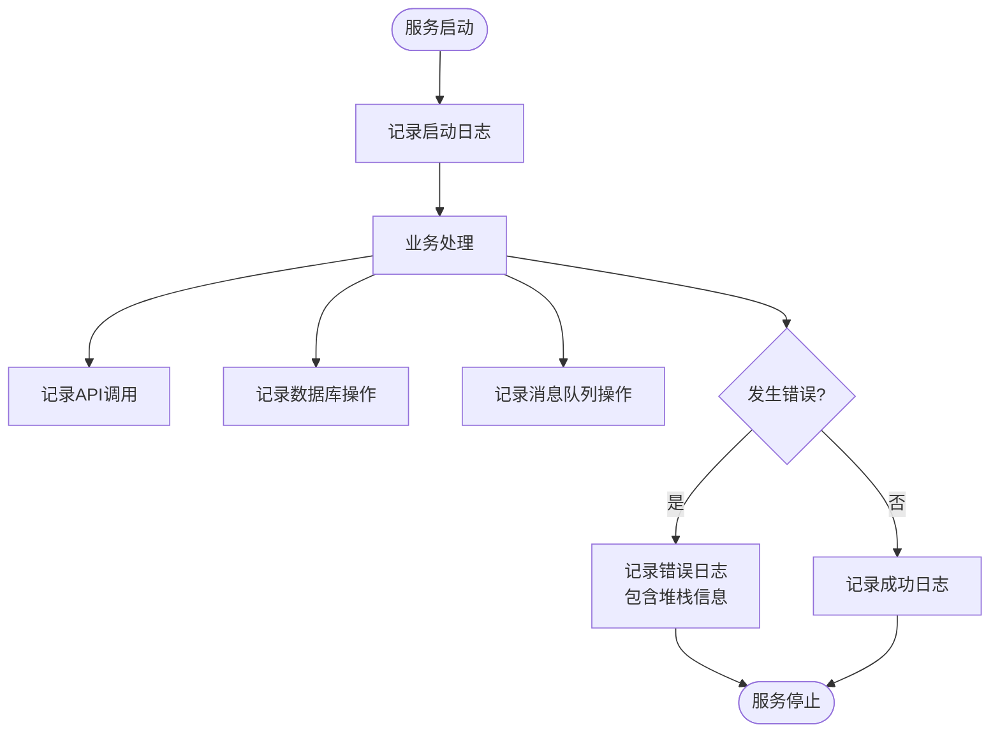

# 服务流程图文档

本文档详细描述 FindQC 商品重构与 AI 聚类系统的完整业务流程，包括各个微服务之间的交互和数据处理流程。

## 一、总体业务流程概览



## 二、详细服务流程

### 2.1 爬虫服务流程 (service_spider)



### 2.2 AI 处理管道流程 (service_ai_pipe)



### 2.3 聚类服务流程 (service_cluster)



## 三、数据流转详细说明

### 3.1 数据在各阶段的形态变化

```mermaid
flowchart LR
    subgraph "阶段1: 爬虫"
        A1[原始商品数据<br/>findqc_id: 12345<br/>itemId: ext_999<br/>mallType: taobao<br/>image_urls: JSON]
    end
    
    subgraph "阶段2: AI处理"
        A2[增强商品数据<br/>pic_url: selected_image<br/>introduce: 商品简介<br/>tags: {brand, model, ...}]
    end
    
    subgraph "阶段3: 聚类"
        A3[聚类结果<br/>cluster_code: taobao_ext_999<br/>members: [item1, item2, ...]<br/>total_sales: 1500]
    end
    
    A1 -->|Qwen选图<br/>Google Lens<br/>Qwen综合| A2
    A2 -->|阿里云图搜<br/>相似度计算| A3
```

### 3.2 消息队列数据格式

#### product.new 消息格式

```json
{
  "task_id": "2024052001",
  "findqc_id": 12345,
  "product_id": 1001,
  "itemId": "ext_999",
  "mallType": "taobao",
  "action": "product.new",
  "timestamp": "2024-05-20T10:00:00Z"
}
```

#### product.labeled 消息格式

```json
{
  "product_id": 1001,
  "findqc_id": 12345,
  "pic_url": "https://example.com/image.jpg",
  "tags": {
    "brand": "Nike",
    "model": "Air Max 270",
    "category": "运动鞋",
    "target_audience": "年轻人",
    "season": "四季",
    "environment": "运动",
    "keywords": "舒适,透气,时尚",
    "ai_confidence": 0.95
  },
  "action": "product.labeled",
  "timestamp": "2024-05-20T10:05:00Z"
}
```

## 四、错误处理和重试机制



## 五、服务间的依赖关系



## 六、关键业务节点说明

### 6.1 爬虫服务关键节点

| 节点 | 说明 | 输出 |
|------|------|------|
| 分类遍历 | 遍历所有需要爬取的分类ID | 分类ID列表 |
| 分页处理 | 按页获取商品列表，直到 `hasMore=False` | 商品ID列表 |
| 商品详情获取 | 获取每个商品的详细信息 | 商品详情JSON |
| 数据入库 | 保存商品基本信息到 t_products | 数据库记录 |
| 任务创建 | 创建 AI 处理任务记录 | t_tasks_products 记录 |

### 6.2 AI 处理管道关键节点

| 节点 | 说明 | 输入 | 输出 |
|------|------|------|------|
| 图片选择 | Qwen 选择1-3张正面图 | 所有商品图片URLs | 选中的图片URLs |
| 初打标签 | Qwen 生成初始标签 | 选中图片 | 初始标签对象 |
| 相似商品识别 | Google Lens 识别相似商品 | 最佳正面图 | 前10条相似商品简介 |
| 标签综合 | Qwen 综合生成最终标签 | 初始标签 + Google Lens结果 | 最终标签对象 |
| 数据更新 | 更新商品表和标签表 | 标签数据 | 数据库记录 |

### 6.3 聚类服务关键节点

| 节点 | 说明 | 输入 | 输出 |
|------|------|------|------|
| 图片搜索 | 调用阿里云图搜API | 商品正面图URL | 相似商品列表（带分值） |
| 分值过滤 | 过滤相似度阈值以下的商品 | 相似商品列表 | 符合条件的相似商品 |
| 聚类判断 | 判断是否属于已有cluster | 相似商品信息 | cluster_code |
| 聚类创建/更新 | 创建新cluster或添加到现有cluster | 商品信息 | cluster和members记录 |
| 统计更新 | 更新cluster的统计数据 | 成员信息 | 更新的统计字段 |

## 七、性能优化建议

### 7.1 并发处理



### 7.2 批量处理优化

- **爬虫服务**: 批量插入数据库，减少数据库连接次数
- **AI 处理**: 批量调用 Qwen API（如果支持）
- **聚类服务**: 批量查询相似商品，减少API调用次数

## 八、监控和日志

### 8.1 关键指标监控

- **爬虫服务**: 爬取速度、成功率、错误率
- **AI 处理**: API调用延迟、标签生成成功率、处理队列长度
- **聚类服务**: 图搜API延迟、聚类准确率、cluster数量

### 8.2 日志记录点



---

**文档版本**: v1.0  
**最后更新**: 2025-12-16  
**维护者**: MadPrinter

